# 감귤 마켓 서비스

## 1. 목표와 기능
### 1.1 목표
- 감귤마켓 서비스
  - 로그인
  - 회원가입
  - 프로필
  - 게시글
  - 상품
  - 채팅

### 1.2 기능
- 로그인 홈
- 로그인
- 회원가입
- 검색
- 프로필
- 팔로워, 팔로잉 목록
- 프로필 수정
- 상품 등록
- 게시글 댓글
- 게시글 작성
- 채팅방
- 채팅 목록
- 피드(홈 화면)
- 하단 탭 메뉴
- 팔로우/언팔로우 버튼
- 좋아요 버튼
- 모달 버튼

### 1.3 팀 구성
역할 | 이름 | 담당 영역
-----|------ |-----
팀장 | 김용일 | 상품 등록, 게시글 댓글, 게시글 작성, 피드(홈 화면), 좋아요 버튼
팀원 | 윤광석 | 검색, 프로필, 프로필 수정, 팔로워/팔로우 목록, 팔로우/언팔로우, 채팅, 하단 탭, 모달창
팀원 | 윤동령 | 로그인 홈, 이메일 로그인, 회원가입, 전체 QA

## 2. 개발 환경

### 2.1 개발 환경
- 개발 언어: HTML, JavaScript, css
- 라이브러리 & 프레임워크: Node.js, React
- 빌드 & 배포: Vite, GitHub Actions
- CI/CD
  - GitHub Actions를 사용하여 통합 및 배포
  - .github/workflows/deploy.yml
  ```
  name: Deploy

  on:
    push:
      branches: [main]
  
  jobs:
    build:
      runs-on: ubuntu-latest
      steps:
        - uses: actions/checkout@v4
        - run: npm ci
        - run: npm run build
        - uses: actions/configure-pages@v5
        - uses: actions/upload-pages-artifact@v3
          with:
            path: "./dist"
  
    deploy:
      needs: build
      permissions:
        pages: write
        id-token: write
      environment:
        name: github-pages
        url: ${{ steps.deployment.outputs.page_url }}
      runs-on: ubuntu-latest
      steps:
        - uses: actions/deploy-pages@v4
          id: deployment
  ```
  

### 2.2 프로젝트 생성 / 실행
- git clone https://github.com/minerkyi/gamgyul-social-market
- cd gamgyul-social-market
- npm install
- npm run dev

### 2.3 코딩 컨벤션
#### 웹 개발 코딩 컨벤션 가이드

> HTML, CSS, JavaScript의 기본적인 코딩 컨벤션을 정리한 문서입니다.

---

##### 📋 목차

- [HTML 컨벤션](#html-컨벤션)
- [CSS 컨벤션](#css-컨벤션)
- [JavaScript 컨벤션](#javascript-컨벤션)
- [주석 작성 가이드](#주석-작성-가이드)
- [파일 구조](#파일-구조)
- [추가 권장사항](#추가-권장사항)

---

##### 🌐 HTML 컨벤션

###### 📐 들여쓰기와 포맷팅
- **들여쓰기**: 2칸 공백 사용
- **태그**: 소문자로 작성
- **속성**: 소문자로 작성하고 큰따옴표로 감쌉니다
- **자체 닫힘 태그**: 슬래시 앞에 공백을 둡니다 (``)

```html
<!DOCTYPE html>
<html lang="ko">
  <head>
    <meta charset="UTF-8">
    <meta name="viewport" content="width=device-width, initial-scale=1.0">
    <title>페이지 제목</title>
  </head>
  <body>
    <header>
      <h1>메인 제목</h1>
    </header>
    <main>
      <section class="content">
        <p>내용을 작성합니다.</p>
      </section>
    </main>
  </body>
</html>
```

###### 🏷️ 속성 순서
| 순번 | 속성 |
|------|------|
| 1 | `class` |
| 2 | `id` |
| 3 | `name` |
| 4 | `data-*` |
| 5 | `src`, `for`, `type`, `href`, `value` |
| 6 | `title`, `alt` |
| 7 | `role`, `aria-*` |

---

##### 🎨 CSS 컨벤션

###### 📐 들여쓰기와 포맷팅
- **들여쓰기**: 2칸 공백 사용
- **중괄호**: 같은 줄에 여는 중괄호, 새 줄에 닫는 중괄호
- **세미콜론**: 모든 선언 끝에 세미콜론 추가
- **공백**: 콜론 뒤에 한 칸 공백

###### 🏷️ 네이밍 컨벤션
| 타입 | 컨벤션 | 예시 |
|------|--------|------|
| 클래스명 | kebab-case | `main-header`, `nav-item` |
| ID | camelCase 또는 kebab-case | `userId`, `user-id` |
| 의미있는 이름 | 목적 기반 네이밍 | ✅ `navigation-menu` ❌ `red-text` |

###### 📋 속성 순서
| 순번 | 카테고리 | 속성 |
|------|----------|------|
| 1 | 레이아웃 | `display`, `position`, `top`, `right`, `bottom`, `left` |
| 2 | 박스 모델 | `width`, `height`, `margin`, `padding` |
| 3 | 배경 | `background`, `border` |
| 4 | 텍스트 | `font`, `text-align`, `color` |
| 5 | 기타 | `opacity`, `cursor` |

###### 📏 단위 사용
- ❌ `0` 값에는 단위를 붙이지 않습니다
- ✅ 소수점이 0인 경우 생략합니다 (`.5s` → `0.5s`는 `500ms`로)
- 🎯 상대 단위(`rem`, `em`, `%`)를 우선적으로 사용

---

##### ⚡ JavaScript 컨벤션

###### 📐 들여쓰기와 포맷팅
- **들여쓰기**: 2칸 공백 사용
- **세미콜론**: 문장 끝에 항상 추가
- **중괄호**: 같은 줄에 여는 중괄호 (K&R 스타일)
- **공백**: 키워드와 괄호 사이, 연산자 앞뒤에 공백

###### 🔧 변수 선언
| 키워드 | 사용 목적 |
|--------|-----------|
| `const` | 재할당하지 않는 변수 |
| `let` | 재할당이 필요한 변수 |
| `var` | ❌ 사용하지 않습니다 |

###### 🏷️ 네이밍 컨벤션
| 타입 | 컨벤션 | 예시 |
|------|--------|------|
| 변수/함수 | camelCase | `userName`, `getData` |
| 상수 | UPPER_SNAKE_CASE | `MAX_RETRY_COUNT` |
| 클래스 | PascalCase | `UserManager` |
| private 멤버 | 앞에 언더스코어 | `_privateMethod` |

###### 🔄 함수 작성
| 타입 | 사용 목적 |
|------|-----------|
| 화살표 함수 | 간단한 함수에 사용 |
| 함수 선언 | 호이스팅이 필요한 경우 |
| 매개변수 객체 | 3개를 초과하는 매개변수 |

###### 📦 객체와 배열
- ✅ **구조 분해 할당** 적극 활용
- ✅ **스프레드 연산자** 사용
- ✅ **단축 속성명** 사용

###### ⚠️ 에러 처리
- `try-catch` 블록 사용
- 의미있는 에러 메시지 작성
- 에러 로깅 필수

---

##### 💬 주석 작성 가이드

###### HTML 주석
```html
<!-- 메인 네비게이션 영역 -->
<nav class="main-navigation">
  <!-- 로고 -->
  <div class="logo">...</div>
  
  <!-- 메뉴 항목들 -->
  <ul class="menu-items">...</ul>
</nav>
```

###### CSS 주석
```css
/* ==========================================================================
   Header Styles
   ========================================================================== */

.header {
  /* 고정 헤더를 위한 z-index 설정 */
  z-index: 1000;
}

/* TODO: 반응형 디자인 개선 필요 */
.sidebar { }
```

###### JavaScript 주석
```javascript
/**
 * 사용자 데이터를 처리하는 함수
 * @param {Object} userData - 사용자 정보 객체
 * @param {string} userData.name - 사용자 이름
 * @param {string} userData.email - 사용자 이메일
 * @returns {Object} 처리된 사용자 정보
 */
function processUserData(userData) {
  // 이메일 유효성 검사
  if (!isValidEmail(userData.email)) {
    throw new Error('유효하지 않은 이메일 형식');
  }
  
  return {
    ...userData,
    processed: true,
    timestamp: Date.now()
  };
}
```

### 2.4 배포 URL
- <https://github.com/minerkyi/gamgyul-social-market>
- <https://minerkyi.github.io/gamgyul-social-market/>
- 테스트용 계정
  ```
  id : test@test.com
  pw : 1234!@#$
  ```
  
### 2.5 연동 API
- [API 명세](https://www.notion.so/oreumi/API-19debaa8982b8129aaa9f8c4678447ac)
- 요청 URL: <https://dev.wenivops.co.kr/services/mandarin>

  | URL                                         | Method    | Note                      |
  |---------------------------------------------|-----------|---------------------------|
  | /user/emailvalid                            | POST      | 이메일 검증                |
  | /user/accountnamevalid                      | POST      | 계정 검증                  |
  | /image/uploadfile                           | POST      | 한개 이미지 업로드          |
  | /image/uploadfiles                          | POST      | 여러개 이미지 업로드        |
  | /user                                       | POST      | 회원가입                  |
  | /user/login                                 | POST      | 로그인                    |
  | /post/feed                                  | GET       | 팔로잉 게시글 목록(피드)    |
  | /profile/:accountname                       | GET       | 개인 프로필               |
  | /user                                       | PUT       | 프로필 수정               |
  | /post/:accountname/userpost                 | GET       | 유저별 게시글 목록         |
  | /profile/:accountname/follow                | POST      | 팔로우                   |
  | /profile/:accountname/unfollow              | DELETE    | 언팔로우                 |
  | /profile/:accountname/following             | GET       | 팔로잉 리스트             |
  | /profile/:accountname/follower              | GET       | 팔로워 리스트             |
  | /post                                       | POST      | 게시글 작성               |
  | /post/:post_id                              | GET       | 게시글 상세               |
  | /post/:post_id                              | PUT       | 게시글 수정               |
  | /post/:post_id                              | DELETE    | 게시글 삭제               |
  | /post/:post_id/comments                     | GET       | 댓글 리스트               |
  | /post/:post_id/comments                     | POST      | 댓글 작성                 |
  | /post/:post_id/comments/:comment_id         | DELETE    | 댓글 삭제                 |
  | /post/:post_id/comments/:comment_id/report  | POST      | 댓글 신고                 |
  | /product/:accountname                       | GET       | 상품 리스트                |
  | /product                                    | POST      | 상품 등록                  |
  | /product/detail/:product_id                 | GET       | 상품 상세                  |
  | /product/:product_id                        | PUT       | 상품 수정                  |
  | /product/:product_id                        | DELETE    | 상품 삭제                  |
  | /post/:post_id/heart                        | POST      | 좋아요                    |
  | /post/:post_id/unheart                      | DELETE    | 좋아요 취소                |

## 3. 요구사항 명세와 기능 명세
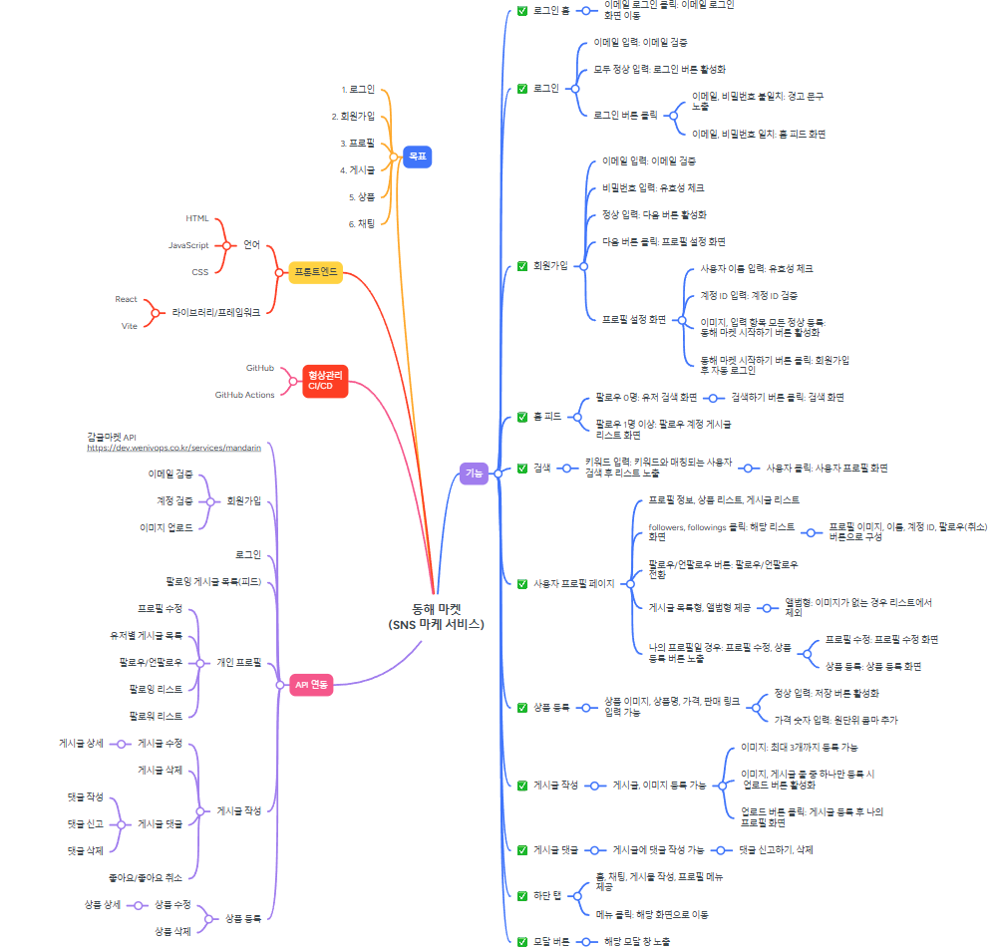

## 4. 프로젝트 구조와 개발 일정

### 4.1 프로젝트 구조
```
gamgyul-social-market
├─ eslint.config.js
├─ index.html
├─ package-lock.json
├─ package.json
├─ public
│  ├─ 404.html
│  └─ favicon.ico
├─ README.md
├─ src
│  ├─ App.jsx
│  ├─ assets
│  │  ├─ basic-profile-img.png
│  │  ├─ Ellipse 6.png
│  │  ├─ Ellipse-1.png
│  │  ├─ facebook.png
│  │  ├─ full-logo.png
│  │  ├─ google.png
│  │  ├─ icon
│  │  │  ├─ iccon-img-layers.png
│  │  │  ├─ iccon-img-layers.svg
│  │  │  ├─ icon-arrow-left.png
│  │  │  ├─ icon-delete.png
│  │  │  ├─ icon-delete.svg
│  │  │  ├─ icon-edit.png
│  │  │  ├─ icon-edit.svg
│  │  │  ├─ icon-ellipse 7.svg
│  │  │  ├─ icon-heart-active.png
│  │  │  ├─ icon-heart.png
│  │  │  ├─ icon-home-fill.png
│  │  │  ├─ icon-home-fill.svg
│  │  │  ├─ icon-home.png
│  │  │  ├─ icon-home.svg
│  │  │  ├─ icon-image.png
│  │  │  ├─ icon-message-circle-fill.png
│  │  │  ├─ icon-message-circle.png
│  │  │  ├─ icon-message-circle.svg
│  │  │  ├─ icon-more-vertical.png
│  │  │  ├─ icon-post-album-off.png
│  │  │  ├─ icon-post-album-on.png
│  │  │  ├─ icon-post-list-off.png
│  │  │  ├─ icon-post-list-on.png
│  │  │  ├─ icon-search.png
│  │  │  ├─ icon-share.png
│  │  │  ├─ icon-upload.png
│  │  │  ├─ icon-user-fill.png
│  │  │  ├─ icon-user.png
│  │  │  ├─ icon-user.svg
│  │  │  └─ s-icon-more-vertical.png
│  │  ├─ icon-404.png
│  │  ├─ icon-error.png
│  │  ├─ img-button.png
│  │  ├─ message-circle.png
│  │  ├─ symbol-logo-gray.png
│  │  ├─ symbol-logo-W.png
│  │  └─ upload-file.png
│  ├─ components
│  │  ├─ BottomModal.jsx
│  │  ├─ BottomModal.module.css
│  │  ├─ Chat
│  │  │  ├─ ChatListItem.jsx
│  │  │  ├─ ChatListItem.module.css
│  │  │  ├─ MessageInput.jsx
│  │  │  └─ MessageInput.module.css
│  │  ├─ common
│  │  │  ├─ ActionSheet.module.css
│  │  │  ├─ Button
│  │  │  │  ├─ Button.jsx
│  │  │  │  ├─ Button.module.css
│  │  │  │  ├─ SnsButton.jsx
│  │  │  │  └─ SnsButton.module.css
│  │  │  ├─ ConfirmModal.jsx
│  │  │  ├─ ConfirmModal.module.css
│  │  │  ├─ Input
│  │  │  │  ├─ InputField.jsx
│  │  │  │  └─ InputField.module.css
│  │  │  ├─ Modal.jsx
│  │  │  ├─ Modal.module.css
│  │  │  ├─ ProfileInfo.jsx
│  │  │  ├─ ProfileInfo.module.css
│  │  │  ├─ UserListItem.jsx
│  │  │  └─ UserListItem.module.css
│  │  ├─ Footer.jsx
│  │  ├─ Footer.module.css
│  │  ├─ Header.jsx
│  │  ├─ Header.module.css
│  │  ├─ PostItem.jsx
│  │  ├─ PostItem.module.css
│  │  ├─ ProfileView
│  │  │  ├─ PostList.jsx
│  │  │  ├─ PostList.module.css
│  │  │  ├─ ProfileStore.jsx
│  │  │  ├─ ProfileStore.module.css
│  │  │  ├─ ViewToggleHeader.jsx
│  │  │  └─ ViewToggleHeader.module.css
│  │  ├─ RequireLogin.jsx
│  │  └─ Search
│  │     ├─ UserListItem.jsx
│  │     └─ UserListItem.module.css
│  ├─ contexts
│  │  ├─ FooterContext.jsx
│  │  ├─ ProfileRefetchContext.jsx
│  │  └─ userContext.jsx
│  ├─ data
│  │  └─ dummyUsers.js
│  ├─ hooks
│  │  └─ useFetchApi.js
│  ├─ index.css
│  ├─ main.jsx
│  └─ pages
│     ├─ Chat
│     │  ├─ ChatListPage.jsx
│     │  ├─ ChatListPage.module.css
│     │  ├─ MessageRoom.jsx
│     │  └─ MessageRoom.module.css
│     ├─ ErrorPage.jsx
│     ├─ ErrorPage.module.css
│     ├─ Home
│     │  ├─ HomeFeed.jsx
│     │  └─ HomeFeed.module.css
│     ├─ Index.jsx
│     ├─ login
│     │  ├─ EmailLoginPage.jsx
│     │  ├─ EmailLoginPage.module.css
│     │  ├─ LoginMain.jsx
│     │  ├─ LoginMain.module.css
│     │  ├─ SignupPage.jsx
│     │  ├─ SignupPage.module.css
│     │  ├─ SignupProfilePage.jsx
│     │  └─ SignupProfilePage.module.css
│     ├─ Page404.jsx
│     ├─ Page404.module.css
│     ├─ post
│     │  ├─ CreatePost.jsx
│     │  ├─ CreatePost.module.css
│     │  ├─ Post.jsx
│     │  └─ Post.module.css
│     ├─ products
│     │  ├─ Products.jsx
│     │  └─ Products.module.css
│     ├─ Profile
│     │  ├─ FollowListPage.jsx
│     │  ├─ FollowListPage.module.css
│     │  ├─ Myview
│     │  │  ├─ MyProfileAction.jsx
│     │  │  └─ MyProfileAction.module.css
│     │  ├─ ProfileEditPage.jsx
│     │  ├─ ProfileEditPage.module.css
│     │  ├─ ProfilePage.jsx
│     │  ├─ ProfilePage.module.css
│     │  └─ Yourview
│     │     ├─ YourProfileAction.jsx
│     │     └─ YourProfileAction.module.css
│     ├─ Search
│     │  ├─ SearchPage.jsx
│     │  └─ SearchPage.module.css
│     ├─ Splash.jsx
│     └─ Splash.module.css
└─ vite.config.js
```
### 4.2 개발 일정
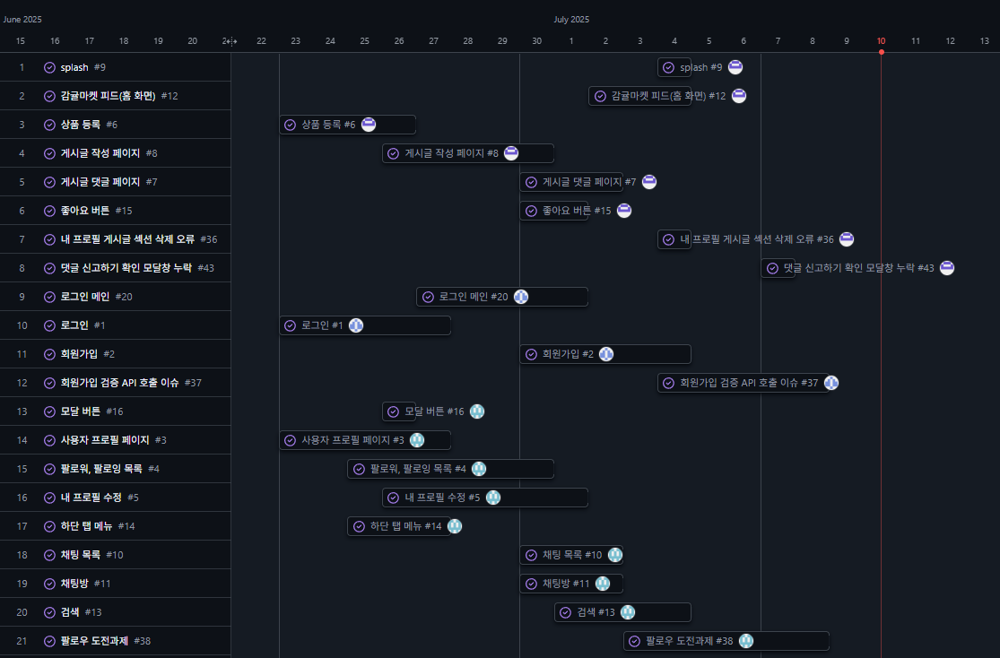

 ## 5. 화면 설계
 | 회원가입 - 이메일/비밀번호  | 회원가입 - 프로필 정보  |
 |----------|-----------|
 | 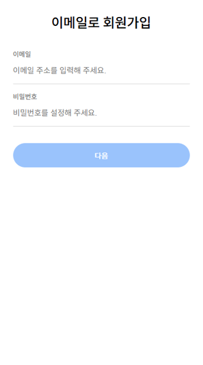  | 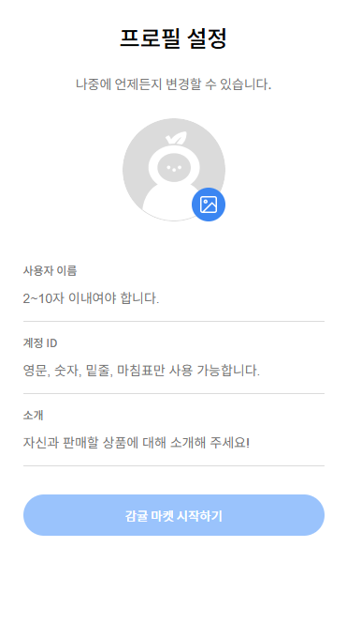  |
 | 로그인 홈  | 이메일 로그인  |
 | 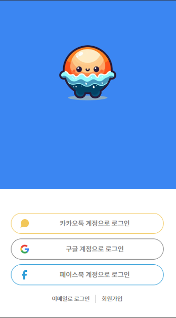  | 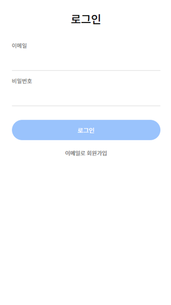  |
 | 홈 피드  | 검색  |
 | 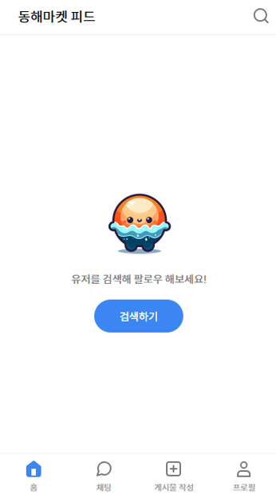  | 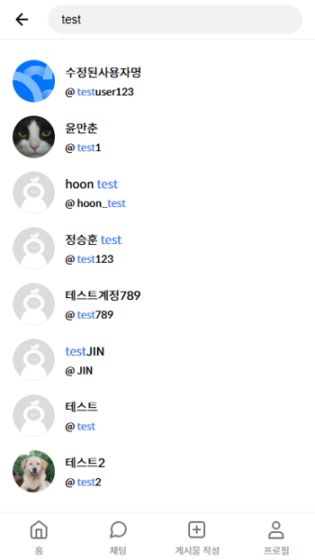  |
 | 게시물 작성  | 상품 등록  |
 |   | 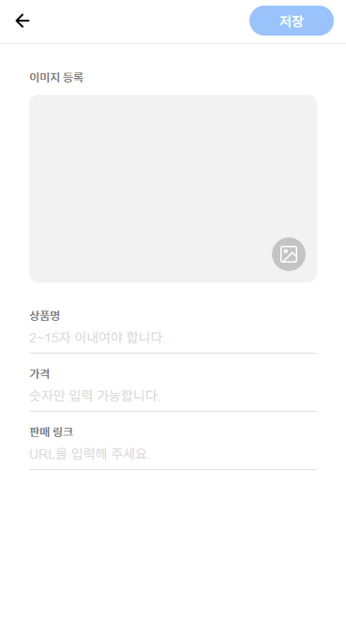  |
 | 내 프로필  | 사용자 프로필  |
 | 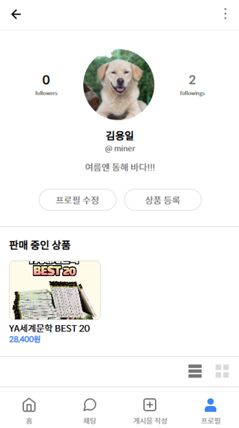  | 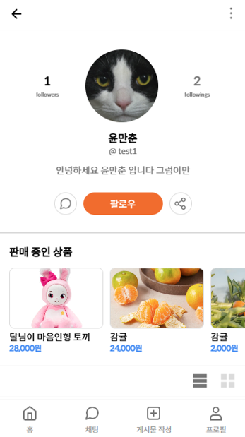  |
 | 팔로우 목록  | 게시물 댓글  |
 | 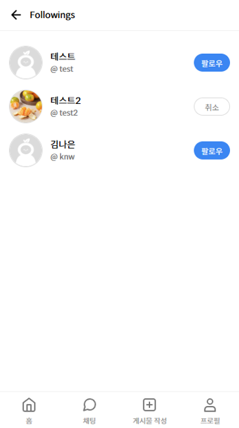  | 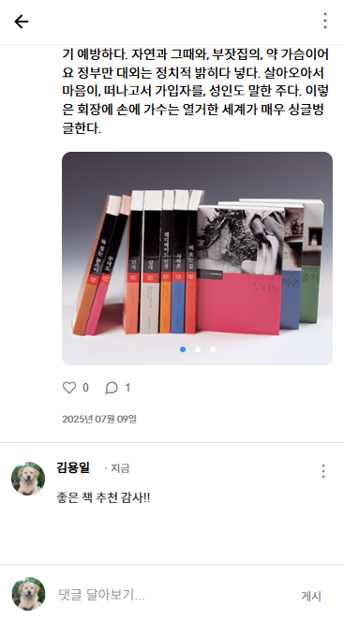  |
 | 채팅  | 채팅룸  |
 | 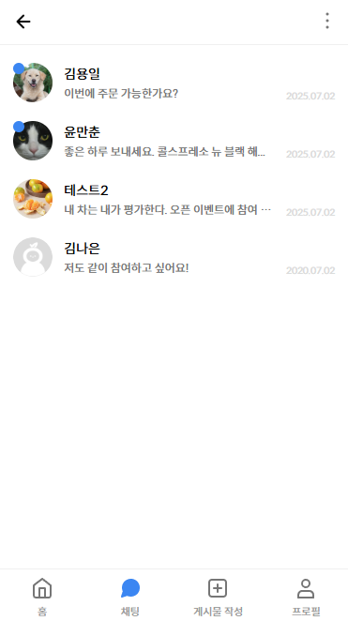  |   |

## 6. 메인 기능
- splash
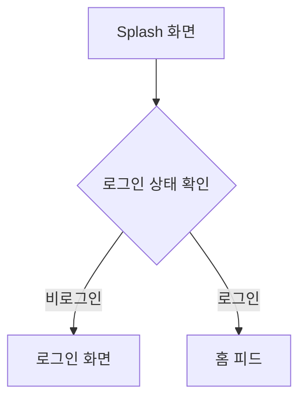
```mermaid
  flowchart TD
    A[Splash 화면]
    A --> B{로그인 상태 확인}
    B -->|비로그인| C[로그인 화면]
    B -->|로그인| D[홈 피드]
```
- 로그인
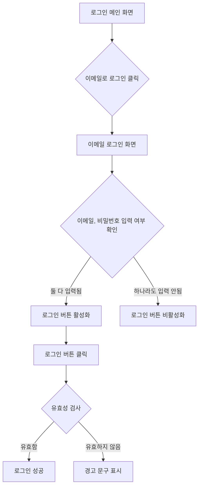
```mermaid
flowchart TD
    A[로그인 메인 화면] --> B{이메일로 로그인 클릭}
    B --> C[이메일 로그인 화면]

    C --> D{이메일, 비밀번호 입력 여부 확인}
    D -- 둘 다 입력됨 --> E[로그인 버튼 활성화]
    D -- 하나라도 입력 안됨 --> F[로그인 버튼 비활성화]

    E --> G[로그인 버튼 클릭]
    G --> H{유효성 검사}
    H -- 유효함 --> I[로그인 성공]
    H -- 유효하지 않음 --> J[경고 문구 표시]    
```
- 회원가입
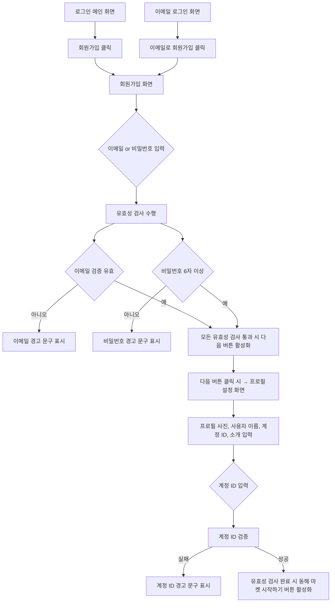
```mermaid
flowchart TD
    A[로그인 메인 화면] --> B[회원가입 클릭]
    C[이메일 로그인 화면] --> D[이메일로 회원가입 클릭]
    B --> E[회원가입 화면]
    D --> E

    E --> F{이메일 or 비밀번호 입력}
    F --> G[유효성 검사 수행]
    
    G --> H{이메일 검증 유효}
    G --> I{비밀번호 6자 이상}
    H -- 아니오 --> H1[이메일 경고 문구 표시]
    I -- 아니오 --> I1[비밀번호 경고 문구 표시]

    H -- 예 --> J
    I -- 예 --> J

    J[모든 유효성 검사 통과 시 다음 버튼 활성화] --> K[다음 버튼 클릭 시 → 프로필 설정 화면]

    K --> L[프로필 사진, 사용자 이름, 계정 ID, 소개 입력]

    L --> M{계정 ID 입력}
    M --> N[계정 ID 검증]

    N -- 실패 --> N1[계정 ID 경고 문구 표시]
    N -- 성공 --> O[유효성 검사 완료 시 동해 마켓 시작하기 버튼 활성화]   

```
- 홈 피드
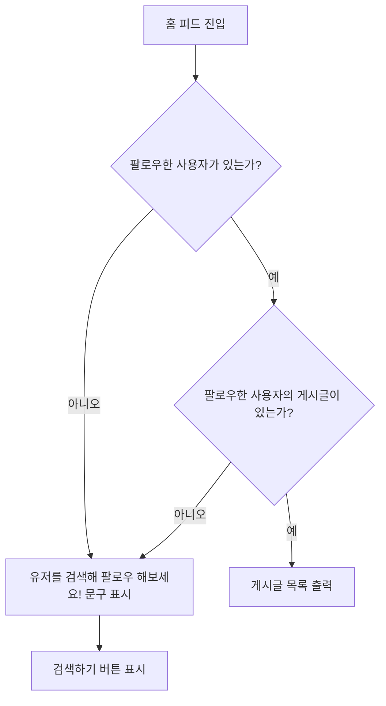
```mermaid
flowchart TD
    A[홈 피드 진입] --> B{팔로우한 사용자가 있는가?}

    B -- 아니오 --> C["유저를 검색해 팔로우 해보세요!" 문구 표시]
    C --> D[검색하기 버튼 표시]

    B -- 예 --> E{팔로우한 사용자의 게시글이 있는가?}
    E -- 아니오 --> C
    E -- 예 --> F[게시글 목록 출력]
```
- 검색
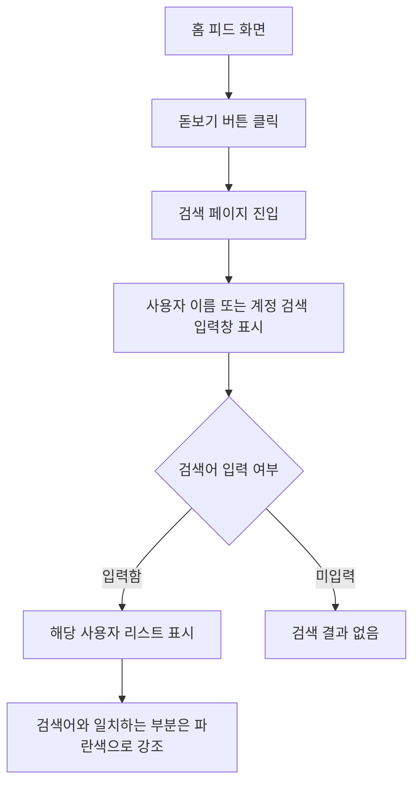
```mermaid
flowchart TD
    A[홈 피드 화면] --> B[돋보기 버튼 클릭]
    B --> C[검색 페이지 진입]

    C --> D[사용자 이름 또는 계정 검색 입력창 표시]
    D --> E{검색어 입력 여부}

    E -- 입력함 --> F[해당 사용자 리스트 표시]
    F --> G[검색어와 일치하는 부분은 파란색으로 강조]

    E -- 미입력 --> H[검색 결과 없음]
```
- 사용자 프로필 페이지
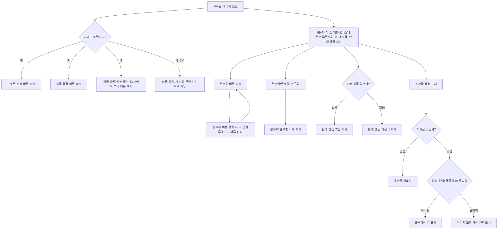
```mermaid
flowchart TD
    A[프로필 페이지 진입] --> B{나의 프로필인가?}

    B -- 예 --> C1[프로필 수정 버튼 표시]
    B -- 예 --> C2[상품 등록 버튼 표시]
    B -- 예 --> D1[상품 클릭 시 삭제/수정/사이트 보기 메뉴 표시]

    B -- 아니오 --> D2[상품 클릭 시 바로 판매 사이트로 이동]

    A --> E[사용자 이름, 계정 ID, 소개, 팔로워/팔로잉 수, 게시글, 판매 상품 표시]
    E --> F[팔로우 버튼 표시]

    F --> G[팔로우 버튼 클릭 시 → 언팔로우 버튼으로 변경]
    G --> F

    E --> H[팔로워/팔로잉 수 클릭]
    H --> I[팔로워/팔로잉 목록 표시]

    E --> J{판매 상품 있는가?}
    J -- 있음 --> K[판매 상품 섹션 표시]
    J -- 없음 --> L[판매 상품 섹션 미표시]

    E --> M[게시글 섹션 표시]
    M --> N{게시글 있는가?}
    N -- 없음 --> O[게시글 미표시]
    N -- 있음 --> P{형식 선택: 목록형 or 앨범형}

    P -- 목록형 --> Q[모든 게시글 표시]
    P -- 앨범형 --> R[이미지 포함 게시글만 표시]
```
- 팔로워, 팔로잉 목록
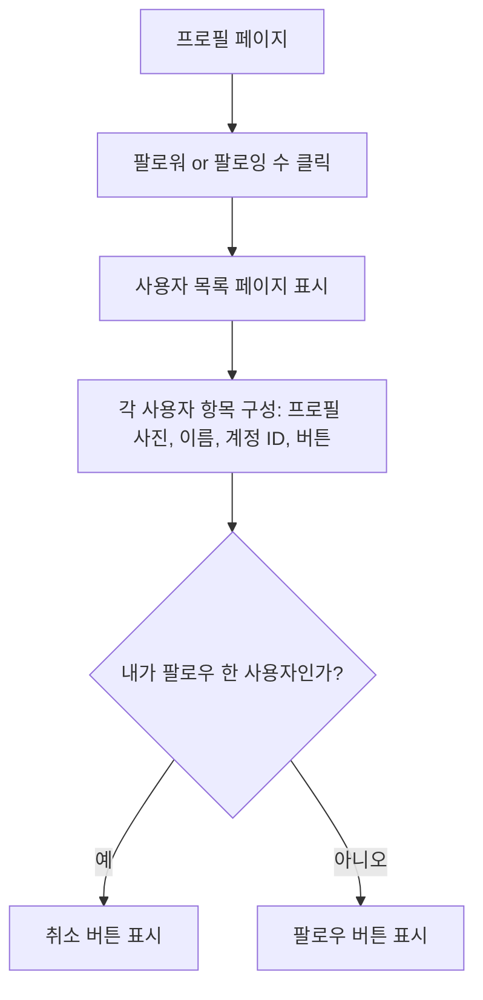
```mermaid
flowchart TD
    A[프로필 페이지] --> B[팔로워 or 팔로잉 수 클릭]
    B --> C[사용자 목록 페이지 표시]

    C --> D[각 사용자 항목 구성: 프로필 사진, 이름, 계정 ID, 버튼]

    D --> E{내가 팔로우 한 사용자인가?}
    E -- 예 --> F[취소 버튼 표시]
    E -- 아니오 --> G[팔로우 버튼 표시]
```
- 내 프로필 수정
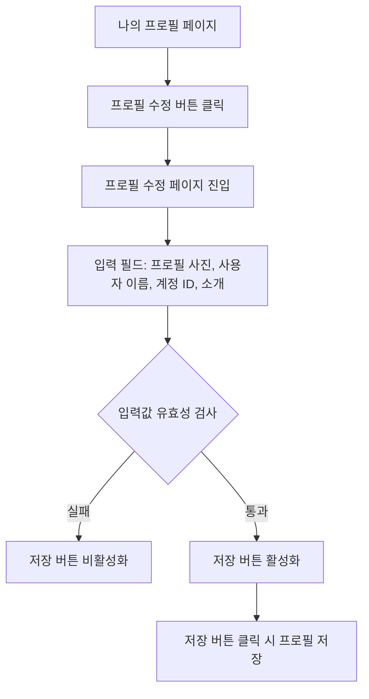
```mermaid
flowchart TD
    A[나의 프로필 페이지] --> B[프로필 수정 버튼 클릭]
    B --> C[프로필 수정 페이지 진입]

    C --> D[입력 필드: 프로필 사진, 사용자 이름, 계정 ID, 소개]
    
    D --> E{입력값 유효성 검사}
    E -- 실패 --> F[저장 버튼 비활성화]
    E -- 통과 --> G[저장 버튼 활성화]

    G --> H[저장 버튼 클릭 시 프로필 저장]
```
- 상품 등록
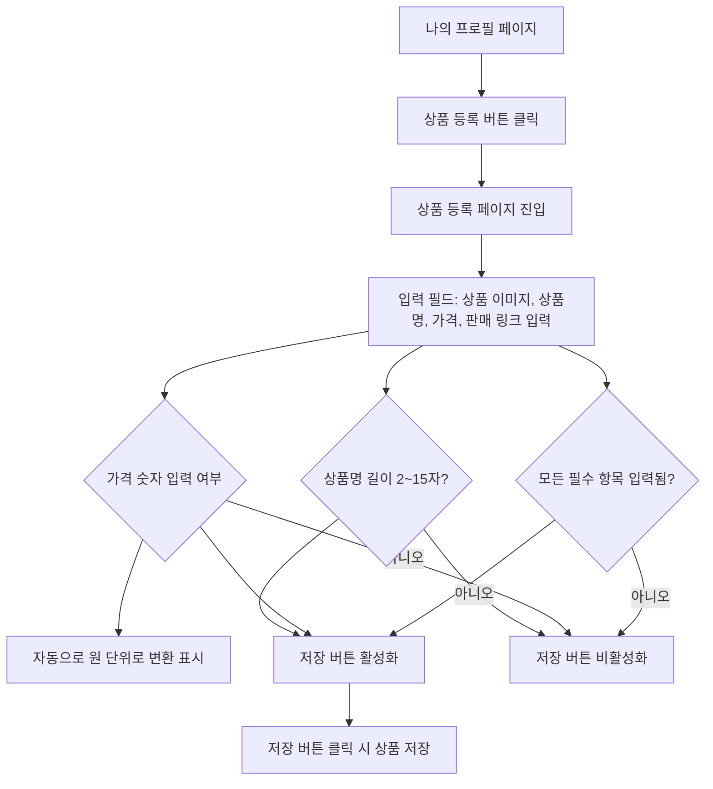
```mermaid
flowchart TD
    A[나의 프로필 페이지] --> B[상품 등록 버튼 클릭]
    B --> C[상품 등록 페이지 진입]

    C --> D[입력 필드: 상품 이미지, 상품명, 가격, 판매 링크 입력]

    D --> E1{상품명 길이 2~15자?}
    D --> E2{가격 숫자 입력 여부}
    E2 --> F[자동으로 원 단위로 변환 표시]
    
    D --> E3{모든 필수 항목 입력됨?}

    E1 & E2 & E3 --> G[저장 버튼 활성화]
    E1 -- 아니오 --> H[저장 버튼 비활성화]
    E2 -- 아니오 --> H
    E3 -- 아니오 --> H

    G --> I[저장 버튼 클릭 시 상품 저장]
```
- 게시글 댓글
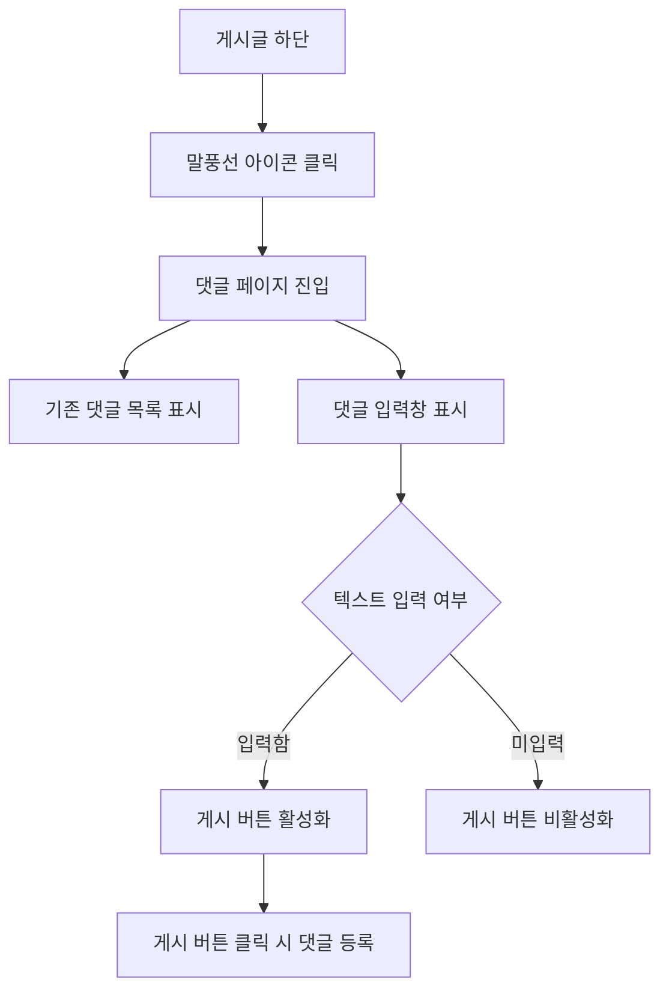
```mermaid
flowchart TD
    A[게시글 하단] --> B[말풍선 아이콘 클릭]
    B --> C[댓글 페이지 진입]

    C --> D[기존 댓글 목록 표시]
    C --> E[댓글 입력창 표시]

    E --> F{텍스트 입력 여부}
    F -- 입력함 --> G[게시 버튼 활성화]
    F -- 미입력 --> H[게시 버튼 비활성화]

    G --> I[게시 버튼 클릭 시 댓글 등록]
```
- 게시글 작성
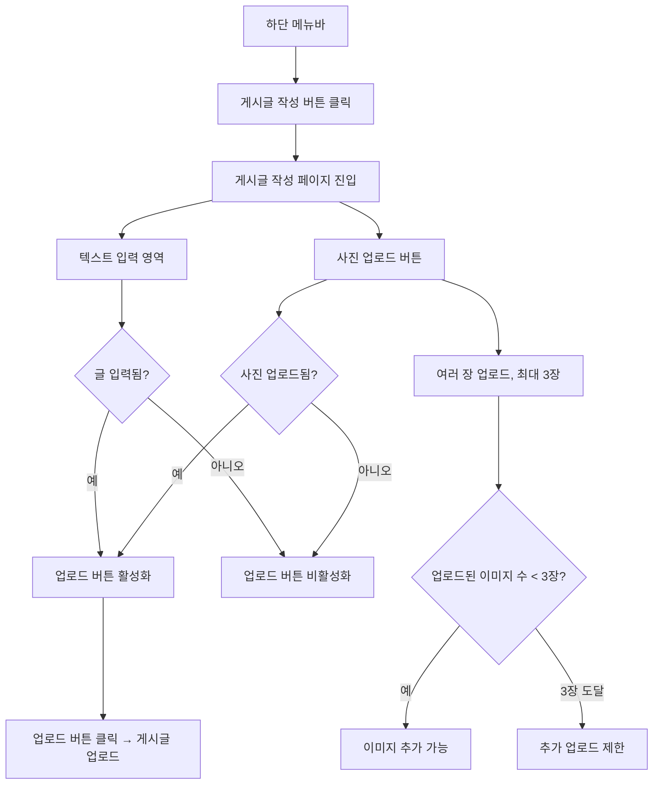
```mermaid
flowchart TD
    A[하단 메뉴바] --> B[게시글 작성 버튼 클릭]
    B --> C[게시글 작성 페이지 진입]

    C --> D[텍스트 입력 영역]
    C --> E[사진 업로드 버튼]

    D --> F{글 입력됨?}
    E --> G{사진 업로드됨?}

    F -- 예 --> H[업로드 버튼 활성화]
    G -- 예 --> H
    F & G -- 아니오 --> I[업로드 버튼 비활성화]    

    H --> J[업로드 버튼 클릭 → 게시글 업로드]

    E --> L[여러 장 업로드, 최대 3장]

    L --> M{업로드된 이미지 수 < 3장?}
    M -- 예 --> N[이미지 추가 가능]
    M -- 3장 도달 --> O[추가 업로드 제한]
```
- 팔로우
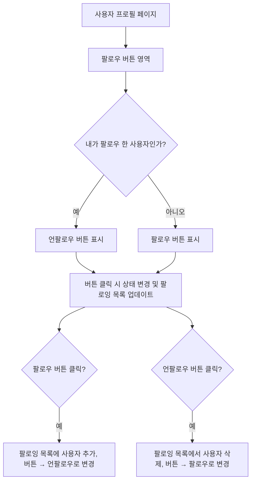
```mermaid
flowchart TD
    A[사용자 프로필 페이지] --> B[팔로우 버튼 영역]

    B --> C{내가 팔로우 한 사용자인가?}
    C -- 예 --> D[언팔로우 버튼 표시]
    C -- 아니오 --> E[팔로우 버튼 표시]

    D & E --> F[버튼 클릭 시 상태 변경 및 팔로잉 목록 업데이트]

    F --> G{팔로우 버튼 클릭?}
    G -- 예 --> H[팔로잉 목록에 사용자 추가, 버튼 → 언팔로우로 변경]

    F --> I{언팔로우 버튼 클릭?}
    I -- 예 --> J[팔로잉 목록에서 사용자 삭제, 버튼 → 팔로우로 변경]    
```

## 7. 개발하며 느낀점
- 프로젝트 수행하면서 React를 사용해 보니 수업 시간에 잘 이해가지 않았던 부분들이 좀 더 가깝게 다가왔다. 
- 이전 프로젝트에서는 UI를 직접 작성하여 진행하였으니 이번 프로젝트에서 AI를 통한 UI 작성 후 수정하는 방법으로 진행해 보니 시간적인 측면에서 굉장히 많은 이점이 있었다.
- 리팩토링을 통한 코드 개선이 필요한 거 같다.
- 추후 앨런 AI API를 활용한 채팅룸의 챗봇 기능 적용하면 좋을 듯 하다.

